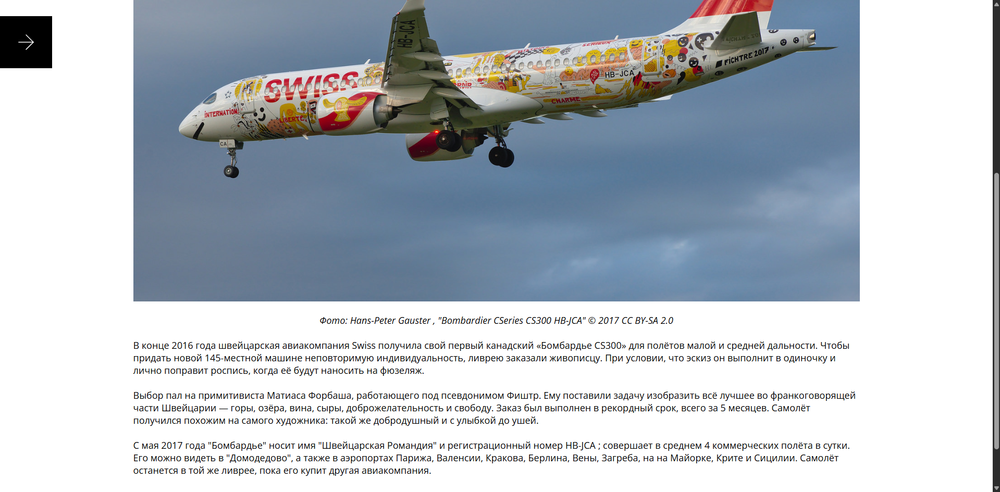
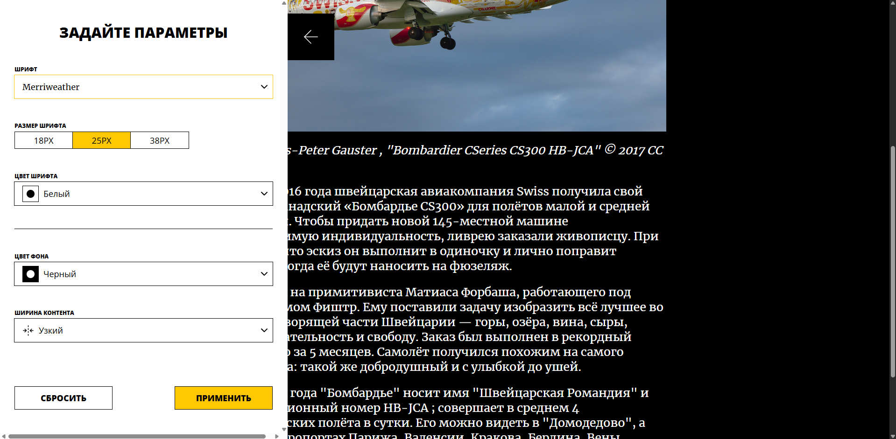

# Сайт с кастомизацией статьи

## Структура проекта:

- src/ — файлы проекта.
- src/components — папка с TSX-компонентами и их стилями.

### Важные файлы:

- src/index.tsx — точка входа приложения.
- src/constants — папка констант.
- src/fonts — папка с шрифтами.
- src/ui - папка с UI-компонентами.

## Что сделала

- Реализовала сайдбар с настройками отображения текста
- Настроила передачу параметров из формы в страницу
- Добавила возможность сбрасывать и применять настройки

## Реализованный функционал

- Кастомизация интерфейса
- Интерактивная форма с применением параметров
- Сохранение и сброс пользовательских настроек

## Технологии

- TS, SCSS, React, Webpack

## Инструкция по запуску

Для запуска проекта нужно выполнить несколько шагов:

1. Создайте папку и перейдите в неё: `cd name_folder`
2. Склонируйте данный репозиторий: `git clone https://github.com/MilanaMur/blog-customizer.git`
3. Установите зависимости: `npm install`
4. Запустите проект: `npm run start`
